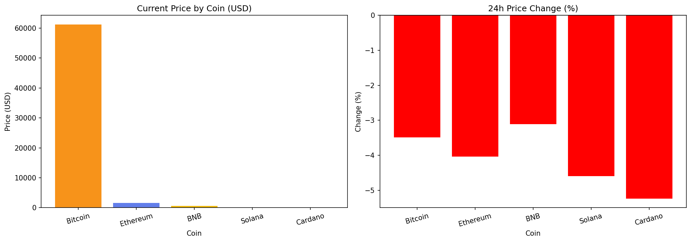
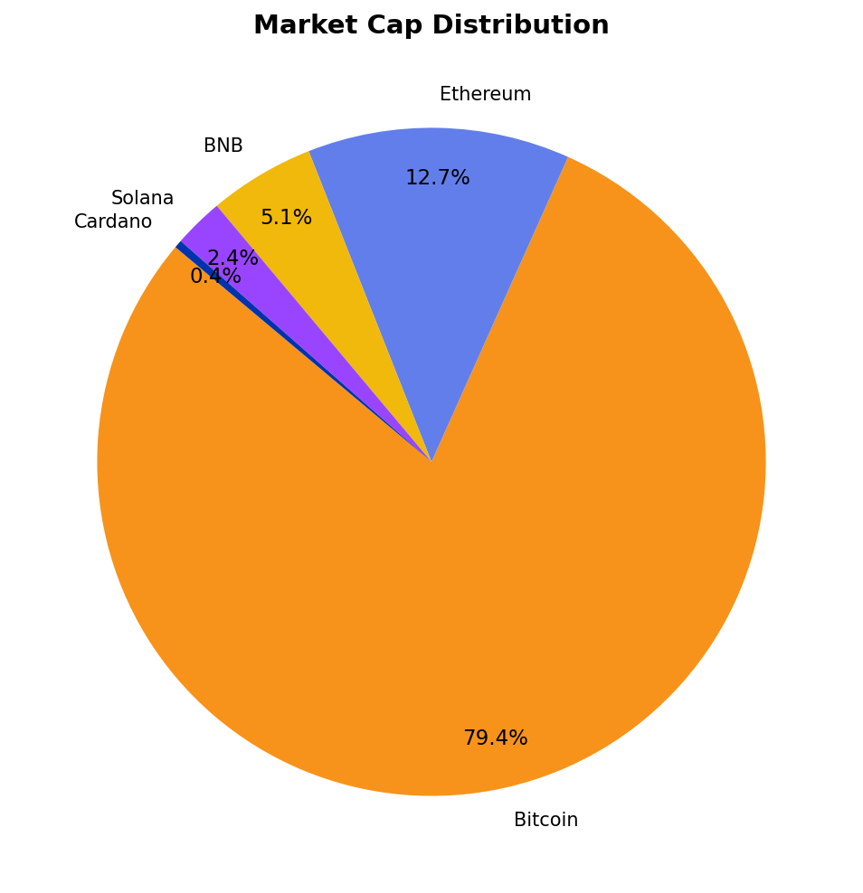

# Cryptocurrency Analytics ETL Pipeline

An automated end-to-end data engineering project that ingests live cryptocurrency market data from the CoinGecko API, processes it through a multi-layer ETL pipeline, stores it in a PostgreSQL data warehouse, and visualizes insights in Power BI.

---

## Architecture
CoinGecko API
↓
Python Extract (requests)
↓
Raw JSON Storage (data/raw/)
↓
PostgreSQL Staging Layer
↓
Data Cleaning & Validation
↓
PostgreSQL Warehouse (Star Schema)
↓
Automated Scheduler (cron)
↓
Power BI Dashboard

---

## Tech Stack

| Layer | Technology |
|---|---|
| Programming | Python 3.9 |
| Database | PostgreSQL 18 |
| ETL Libraries | pandas, SQLAlchemy, psycopg2 |
| API | CoinGecko (free, no key required) |
| Visualization | Power BI Service |
| Automation | cron (macOS) |
| Version Control | Git & GitHub |

---

## Data Model

### Staging Layer
- `staging.crypto_prices` — raw API data loaded as-is

### Warehouse Layer (Star Schema)
- `warehouse.dim_coin` — coin dimension (Bitcoin, Ethereum, etc.)
- `warehouse.dim_date` — date dimension (year, month, quarter, day)
- `warehouse.fact_crypto_prices` — price, market cap, volume facts

---

## Pipeline Steps

1. **Extract** — calls CoinGecko API, saves raw JSON to `data/raw/`
2. **Load Staging** — inserts raw data into `staging.crypto_prices`
3. **Transform** — builds dimension and fact tables in warehouse schema
4. **Export** — generates CSV files for Power BI consumption
5. **Automate** — cron job runs full pipeline every hour

---

## Coins Tracked

| Coin | Symbol |
|---|---|
| Bitcoin | BTC |
| Ethereum | ETH |
| BNB | BNB |
| Solana | SOL |
| Cardano | ADA |

---

## Data Quality Checks

Notebook: `notebooks/data_quality.ipynb`

- Null value detection across all columns
- Duplicate record detection
- Data type validation
- Statistical outlier analysis
- Visual price and market cap distribution

---

## Charts




---

## Project Structure
crypto-etl-project/
│
├── data/raw/              ← Raw API responses (JSON)
├── exports/               ← CSV exports for Power BI
├── scripts/
│   ├── extract.py         ← API extraction
│   ├── load_staging.py    ← Staging layer load
│   ← transform.py        ← Warehouse transformation
│   ├── export.py          ← CSV export
│   └── etl_runner.py      ← Pipeline orchestrator
├── sql/
│   ├── staging_schema.sql
│   └── warehouse_schema.sql
├── notebooks/
│   └── data_quality.ipynb
├── images/
├── dashboards/
├── README.md
└── requirements.txt

---

## How to Run

```bash
# Clone the repo
git clone https://github.com/sanda0620/crypto-etl-project.git
cd crypto-etl-project

# Create virtual environment
python3 -m venv venv
source venv/bin/activate
pip install -r requirements.txt

# Set up environment variables
cp .env.example .env
# Edit .env with your PostgreSQL credentials

# Set up database
psql -d crypto_db -f sql/staging_schema.sql
psql -d crypto_db -f sql/warehouse_schema.sql

# Run the pipeline
python scripts/etl_runner.py
```

---

## Automation

Pipeline runs every hour via cron:
0 * * * * cd /path/to/project && python scripts/etl_runner.py >> logs/etl.log 2>&1

---

## Key Skills Demonstrated

- ETL pipeline design and implementation
- REST API integration and JSON processing
- PostgreSQL data warehouse design (star schema)
- Dimensional modeling (fact and dimension tables)
- Data quality validation and monitoring
- Pipeline automation with cron scheduling
- Data visualization with Power BI
- Python best practices (virtual environments, dotenv, modular scripts)
- Git version control and GitHub project management